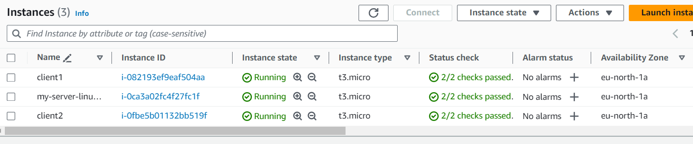
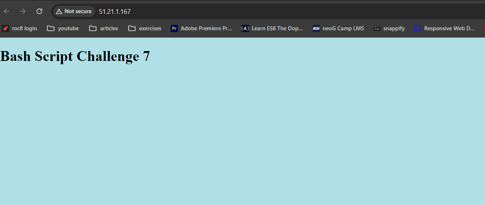
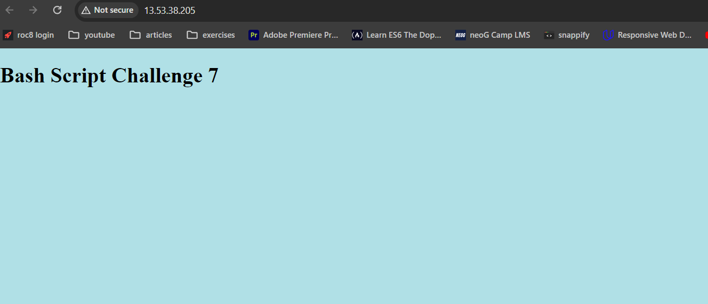

# Solution

1. Set up a network of three virtual machines: server, client1, and client2.



2. Generate SSH key pairs for secure authentication.

 ```
Create a public and private key pair in Master server using the below command
ssh-keygen -t rsa -C "server"
```

3. Configure passwordless SSH authentication between the machines.
```
Copy the public key from /home/username/.ssh/id_rsa.pub to client 1 and client 2 
authorized_keys file

cd ~/.ssh is the location where authorized_keys file is stored and it has the Public Keys
```

4. Write a Bash script that remotely executes commands on the client1 and client2 VMs from the server.
```
#!/bin/bash
username="username"
ip="ip address"

ssh $username@$ip cat /tmp/dummy.txt
```

5.  Use scp to securely transfer files between the VMs.
```
scp hello.txt  username@ip:/tmp
```

6.  Containerize a simple web application using Docker.
```
Create a folder web-app

Add custom index.html file

Create a docker file 

FROM nginx:latest
COPY . /usr/share/nginx/html
EXPOSE 80

Build an image
docker build -t web-app .

Run the Container
docker run -d -p 80:80 web-app:latest
```

7. Deploy the web application on the client1 and client2 VMs using Nginx as a reverse proxy.
```
Pre Requisite: Install Docker on client 1 and client 2
```
deploy.sh script
```
#!/bin/bash

username1="username1"
username2="username2"

ip1="ip1"
ip2="ip2"

#1. Copy the Docker Image to client 1 and client 2

docker save -o image.tar web-app

scp image.tar $username1@$ip1:/home/$username1
scp image.tar $username2@$ip2:/home/$username2

ssh $username1@$ip1 docker load -i /home/$username1/image.tar
ssh $username2@$ip2 docker load -i /home/$username2/image.tar

#2. Run the remote ssh docker run command in both client 1 and client 2

ssh $username1@$ip1 docker run -d -p 80:80 web-app:latest
ssh $username2@$ip2 docker run -d -p 80:80 web-app:latest
```

8. Validate successful web application deployment.



